# Tasks: AI智能菜谱推荐

**Feature**: `001-ai-recipe-recommendation` | **Date**: 2025-12-04
**Spec**: [spec.md](./spec.md) | **Plan**: [plan.md](./plan.md) | **Research**: [research.md](./research.md)

---

## 任务概述

本文档将功能需求分解为可执行的任务清单，按优先级和依赖关系组织。任务遵循项目宪章的五大核心原则（组件化优先、数据优先、测试先行、用户体验一致性、性能与优化）。

**总任务数**: 87个任务
**预估工作量**: 120-150小时
**推荐迭代周期**: 4个Sprint（每个Sprint 2周）

---

## 任务优先级说明

- **P0** - 阻塞性任务：必须最先完成，阻塞其他任务
- **P1** - 高优先级：核心用户故事 (US-001语音输入食材识别)
- **P2** - 中优先级：核心用户故事 (US-002 AI菜谱智能推荐)
- **P3** - 低优先级：增强功能 (US-003菜谱详情查看)
- **P4** - 最低优先级：可选功能 (US-004收藏菜谱)

---

## Phase 0: 基础设施搭建 (Setup & Infrastructure)

**目标**: 搭建项目骨架、配置开发环境、创建数据库schema

### 0.1 项目初始化

- [x] **TASK-001** [P0] 创建uni-app前端项目骨架
  - 使用HBuilderX或CLI创建uni-app Vue 3项目
  - 配置manifest.json (微信小程序appid、平台权限)
  - 配置pages.json (路由、tabBar、全局样式)
  - 安装依赖: pinia, pinia-plugin-unistorage, uni-ui, axios
  - 文件: `frontend/manifest.json`, `frontend/pages.json`, `frontend/package.json`

- [x] **TASK-002** [P0] 创建Node.js后端项目骨架
  - 初始化package.json (Node.js 16+)
  - 安装依赖: express/koa, mysql2, sequelize, sharp, axios, bull, socket.io, dotenv
  - 创建基础目录结构: src/models, src/services, src/api/routes, src/jobs, src/config
  - 配置ESLint + Prettier
  - 文件: `backend/package.json`, `backend/.eslintrc.js`, `backend/src/app.js`

- [x] **TASK-003** [P0] 配置数据库环境
  - 安装MySQL 8.0+ (本地开发环境)
  - 创建数据库 `fridge_menu_db`
  - 配置Redis (用于缓存图片查询)
  - 创建数据库配置文件
  - 文件: `backend/src/config/database.js`

### 0.2 数据库Schema实现

- [x] **TASK-004** [P0] [US-001] 创建ingredients表
  - 字段: id, user_id, name, category, quantity, unit, created_at
  - 索引: user_id, created_at
  - 文件: `database/schema/ingredients.sql`

- [x] **TASK-005** [P0] [US-002] 创建recipes表
  - 字段: id, dish_name, ingredients_json, steps_json, cooking_time, difficulty, created_at
  - 索引: dish_name, created_at
  - 文件: `database/schema/recipes.sql`

- [x] **TASK-006** [P0] [US-004] 创建favorites表
  - 字段: id, user_id, recipe_id, favorited_at
  - 索引: user_id, recipe_id, 联合唯一索引(user_id, recipe_id)
  - 文件: `database/schema/favorites.sql`

- [x] **TASK-007** [P0] [US-002] 创建image_library表
  - 字段: id, normalized_dish_name, recipe_hash, image_url, image_hash, image_size_kb, usage_count, last_used_at, created_at
  - 主要索引: idx_normalized_dish_name (B-Tree, 用于复用查询)
  - 辅助索引: idx_usage_count (DESC), idx_last_used_at (DESC)
  - 唯一索引: recipe_hash (用于防止并发重复生成)
  - 匹配策略说明:
    - 图片复用: 按normalized_dish_name查询（忽略食材细微差异）
    - 去重检查: 按recipe_hash验证（防止并发重复生成）
    - image_hash: 图片内容MD5，用于存储去重
  - 文件: `database/schema/image_library.sql`

- [x] **TASK-008** [P0] [US-002] 创建food_synonym_mapping表
  - 字段: id, synonym_name, standard_name, category, priority
  - 索引: idx_standard_name, 唯一索引(synonym_name)
  - 初始化150-200条同义词规则 (西红柿→番茄)
  - 文件: `database/schema/food_synonym_mapping.sql`, `database/seeds/food_synonyms.sql`

- [x] **TASK-009** [P0] 运行数据库迁移脚本
  - 执行所有SQL schema文件
  - 验证表结构和索引创建成功
  - 插入种子数据 (food_synonyms)
  - 文件: `backend/migrations/001_initial_schema.sql`

### 0.3 云服务配置

- [x] **TASK-010** [P0] 配置阿里云服务
  - 获取阿里云AccessKey/SecretKey
  - 配置通义千问API (DashScope SDK)
  - 配置通义万相API (DashScope SDK)
  - 配置阿里云OSS (临时图片存储)
  - 文件: `backend/src/config/aliyun.js`

- [x] **TASK-011** [P0] 配置微信小程序
  - 获取微信小程序AppID/AppSecret
  - 配置微信登录授权
  - 配置微信语音识别插件 (插件市场)
  - 文件: `backend/src/config/wechat.js`, `frontend/manifest.json`

- [x] **TASK-012** [P0] 配置自有云存储/CDN
  - 选择永久存储方案 (阿里云OSS或腾讯云COS)
  - 配置CDN加速域名
  - 实现图片上传工具函数
  - 文件: `backend/src/services/storageService.js`

---

## Phase 1: 核心数据模型与服务 (P0 Foundational)

**目标**: 实现数据模型、核心服务类、API基础架构

### 1.1 数据模型实现

- [x] **TASK-013** [P0] [US-001] 实现Ingredient模型
  - 使用Sequelize ORM定义模型
  - 实现CRUD方法 (create, findByUserId, delete)
  - 实现食材去重逻辑 (同一用户不重复添加相同食材)
  - 文件: `backend/src/models/Ingredient.js`

- [x] **TASK-014** [P0] [US-002] 实现Recipe模型
  - 定义菜谱结构 (dish_name, ingredients, steps, cooking_time)
  - 实现查询方法 (findByDishName, findByIngredients)
  - 文件: `backend/src/models/Recipe.js`

- [x] **TASK-015** [P0] [US-004] 实现Favorite模型
  - 定义收藏关系 (user_id, recipe_id)
  - 实现收藏/取消收藏方法
  - 实现查询用户收藏列表 (分页支持)
  - 文件: `backend/src/models/Favorite.js`

- [x] **TASK-016** [P0] [US-002] 实现ImageLibrary模型
  - 定义图片库字段
  - 实现图片查询方法 (findByNormalizedDishName)
  - 实现使用统计更新 (updateUsageCount, updateLastUsedAt)
  - 文件: `backend/src/models/ImageLibrary.js`

- [x] **TASK-016.1** [P0] [US-002] 实现FoodSynonymMapping模型
  - 定义同义词映射字段
  - 实现规范化方法 (normalize, normalizeAll)
  - 实现内存缓存和Redis缓存
  - 文件: `backend/src/models/FoodSynonymMapping.js`

### 1.2 API基础架构

- [x] **TASK-017** [P0] 实现Express/Koa应用入口
  - 配置中间件 (body-parser, cors, helmet)
  - 配置错误处理中间件
  - 配置日志中间件 (winston/morgan)
  - 启动HTTP服务器 (端口3000)
  - 文件: `backend/src/app.js`

- [x] **TASK-018** [P0] 实现微信授权中间件
  - 验证微信用户session_key
  - 从请求头提取user_id (openid)
  - 处理未授权错误 (401)
  - 文件: `backend/src/api/middleware/auth.js`

- [x] **TASK-019** [P0] 实现限流中间件
  - 使用express-rate-limit限制API调用频率
  - 针对AI接口设置更严格限流 (防刷量)
  - 文件: `backend/src/api/middleware/rateLimit.js`

- [x] **TASK-020** [P0] 实现参数验证器
  - 使用joi或express-validator验证请求参数
  - 创建voiceValidator (语音文本验证)
  - 创建recipeValidator (菜谱参数验证)
  - 文件: `backend/src/api/validators/voiceValidator.js`, `backend/src/api/validators/recipeValidator.js`

---

## Phase 2: User Story 1 - 语音输入食材识别 (P1)

**用户故事**: 作为用户，我希望通过语音说出家中现有的食材，系统能识别并列出食材清单，这样我可以快速输入而不用打字。

### 2.1 前端语音输入组件

- [x] **TASK-021** [P1] [US-001] 创建VoiceInput组件
  - 使用微信wx.startRecord API录制语音
  - 显示录音动画和倒计时 (最长60秒)
  - 调用微信语音识别插件转换为文本
  - Props: onVoiceResult (回调函数)
  - Events: voice-start, voice-end, voice-error
  - 文件: `frontend/src/components/VoiceInput/VoiceInput.vue`

- [x] **TASK-022** [P1] [US-001] 创建IngredientList组件
  - 显示食材列表 (卡片形式)
  - 支持手动删除食材 (左滑删除)
  - 支持手动添加食材 (输入框)
  - Props: ingredients (数组), onDelete, onAdd
  - 文件: `frontend/src/components/IngredientList/IngredientList.vue`

- [x] **TASK-023** [P1] [US-001] 实现首页 (index)
  - 集成VoiceInput组件
  - 集成IngredientList组件
  - 添加"开始推荐"按钮 (跳转到推荐页面)
  - 使用Pinia状态管理食材列表
  - 文件: `frontend/src/pages/index/index.vue`

### 2.2 后端语音识别服务

- [x] **TASK-024** [P1] [US-001] 实现voiceService
  - 封装微信语音识别API调用
  - 实现语音文本提取食材逻辑 (使用AI大模型NER)
  - 调用通义千问API: Prompt = "从以下文本中提取食材名称: {voice_text}"
  - 返回食材数组 (去重、规范化)
  - 文件: `backend/src/services/voiceService.js`

- [x] **TASK-025** [P1] [US-001] 实现食材去重和规范化算法
  - 算法步骤:
    1. 输入食材数组进行字符清洗（去除空格、emoji、特殊字符）
    2. 查询food_synonym_mapping表按priority倒序查找同义词规则
    3. 应用同义词映射（如"西红柿"→"番茄"，"土豆"→"马铃薯"）
    4. 按standard_name分组去重（同一用户会话内）
    5. 返回规范化后的食材列表：`[{original: "西红柿", normalized: "番茄", category: "蔬菜"}]`
  - 边界处理: 无匹配规则的食材保持原样，记录到日志
  - 文件: `backend/src/services/ingredientNormalizationService.js`

- [x] **TASK-026** [P1] [US-001] 实现语音识别API路由
  - POST /api/v1/voice/recognize
  - 请求参数: voice_text (string)
  - 返回: { ingredients: string[] }
  - 集成voiceService和食材规范化
  - 文件: `backend/src/api/routes/voice.js`

### 2.3 状态管理与本地存储

- [x] **TASK-027** [P1] [US-001] 实现ingredients状态管理
  - 使用Pinia创建ingredientsStore
  - State: ingredientList (数组)
  - Actions: addIngredients, removeIngredient, clearAll
  - 集成pinia-plugin-unistorage持久化到本地
  - 文件: `frontend/src/store/ingredients.js`

- [x] **TASK-028** [P1] [US-001] 实现API服务层 (前端)
  - 创建voiceService.js封装API调用
  - 方法: recognizeVoice(voiceText) → Promise<string[]>
  - 错误处理和loading状态管理
  - 文件: `frontend/src/services/voice.js`

- [x] **TASK-028.1** [P1] [US-001] 实现"做"按钮防抖逻辑 [FR-011]
  - 在首页和推荐页的"做"按钮添加防抖保护
  - 点击后2秒内禁用按钮，显示loading状态
  - 显示倒计时提示"请稍候..."
  - API调用完成或失败后恢复按钮状态
  - 集成到TASK-023首页和TASK-043推荐页面实现中
  - 文件: `frontend/src/pages/index/index.vue`, `frontend/src/utils/debounce.js`

---

## Phase 3: User Story 2 - AI菜谱智能推荐 (P2)

**用户故事**: 作为用户，我希望系统根据我的食材推荐可制作的菜谱，并为每道菜异步生成图片，这样我可以有视觉参考。

### 3.1 后端AI推荐服务

- [x] **TASK-029** [P2] [US-002] 实现aiService (通义千问菜谱推荐)
  - 设计Prompt工程: "根据食材{ingredients}推荐5道菜谱"
  - 调用通义千问API (dashscope SDK)
  - 解析AI返回JSON: [{dish_name, ingredients, steps, cooking_time, difficulty}]
  - 实现错误重试机制 (3次)
  - 成本控制: 记录Token消耗
  - 文件: `backend/src/services/aiService.js`

- [x] **TASK-030** [P2] [US-002] 实现recipeService (菜谱业务逻辑)
  - 调用aiService获取推荐菜谱
  - 保存菜谱到recipes表
  - 为每道菜触发图片生成任务 (异步)
  - 返回菜谱列表 (不等待图片生成)
  - 文件: `backend/src/services/recipeService.js`

- [x] **TASK-031** [P2] [US-002] 实现菜谱推荐API路由
  - POST /api/v1/recipes/recommend
  - 请求参数: { ingredients: string[] }
  - 返回: { recipes: Recipe[], task_ids: string[] }
  - 集成recipeService
  - 文件: `backend/src/api/routes/recommend.js`

### 3.2 图片生成与复用服务

- [x] **TASK-032** [P2] [US-002] 实现菜名规范化服务
  - 字符标准化 (移除emoji、特殊字符)
  - 同义词映射 (查询food_synonym_mapping表)
  - 食材排序 (提取主要食材并排序)
  - 返回normalized_dish_name
  - 文件: `backend/src/services/aiService.js` (normalizeDishName函数)

- [x] **TASK-033** [P2] [US-002] 实现图片复用匹配服务
  - 步骤1: 调用菜名规范化服务获取normalized_dish_name
  - 步骤2: 查询Redis缓存: cache_key = `image:dish:{normalized_name}`
  - 步骤3: 缓存未命中时查询image_library表 (WHERE normalized_dish_name = ?)
  - 步骤4: 如果找到匹配，更新usage_count+1和last_used_at
  - 步骤5: 写入Redis缓存 (高频图片TTL=24h, 低频TTL=1h)
  - 注意: recipe_hash仅用于新图片保存时的去重检查，不用于复用查询
  - 返回: { found: boolean, image_url?: string, image_id?: number }
  - 文件: `backend/src/models/ImageLibrary.js` (findByNormalizedDishName方法)

- [x] **TASK-034** [P2] [US-002] 实现AI图片生成服务 (通义万相)
  - 设计Prompt: "生成{dish_name}的高清美食图片"
  - 调用通义万相API提交任务
  - 实现轮询机制 (间隔10秒, 最多等待120秒)
  - 获取OSS临时URL (24小时有效)
  - 返回图片URL
  - 文件: `backend/src/services/imageService.js`

- [x] **TASK-035** [P2] [US-002] 实现图片格式转换服务
  - 使用Sharp库下载PNG图片
  - 转换为JPG格式 (quality: 80%)
  - 验证文件大小减少至少70%
  - 返回JPG Buffer
  - 文件: `backend/src/services/storageService.js` (convertPngToJpg函数)

- [x] **TASK-036** [P2] [US-002] 实现云存储上传服务
  - 从OSS临时URL下载图片
  - 调用图片格式转换服务 (PNG→JPG)
  - 上传到自有CDN (永久URL)
  - 保存到image_library表
  - 删除OSS临时文件
  - 文件: `backend/src/services/storageService.js`

### 3.3 异步任务队列

- [x] **TASK-037** [P2] [US-002] 配置BullMQ任务队列
  - 安装bull依赖
  - 配置Redis连接
  - 创建imageGenerationQueue队列
  - 文件: `backend/src/jobs/queue.js`

- [x] **TASK-038** [P2] [US-002] 实现图片生成任务处理器
  - 监听imageGenerationQueue
  - 任务逻辑:
    1. 查询图片复用服务 (是否已有图片)
    2. 如有 → 直接返回
    3. 如无 → 调用AI图片生成服务
    4. 调用云存储上传服务
    5. 通过WebSocket推送进度给前端
  - 错误处理: 失败3次后标记为失败
  - 文件: `backend/src/jobs/imageGenerationJob.js`

- [x] **TASK-039** [P2] [US-002] 实现图片下载转存定时任务
  - 使用node-cron定时扫描 (每小时)
  - 查询image_library中OSS临时URL (created_at < 20小时)
  - 调用云存储上传服务转存到永久CDN
  - 更新image_url为永久URL
  - 文件: `backend/src/jobs/imageDownloadJob.js`

### 3.4 WebSocket实时推送

- [x] **TASK-040** [P2] [US-002] 配置Socket.io服务器
  - 集成Socket.io到Express/Koa
  - 配置CORS和认证
  - 监听客户端连接
  - 文件: `backend/src/app.js` (集成部分)

- [x] **TASK-041** [P2] [US-002] 实现图片生成进度推送
  - 事件名称: `image:progress`
  - 推送数据: { recipe_id, status: 'pending'|'processing'|'completed'|'failed', image_url? }
  - 在图片生成任务处理器中调用
  - 文件: `backend/src/services/socketService.js`

### 3.5 前端菜谱推荐页面

- [x] **TASK-042** [P2] [US-002] 创建RecipeCard组件
  - 显示菜名、食材、烹饪时间、难度
  - 图片区域:
    - 加载中: 显示骨架屏
    - 生成失败: 隐藏图片区域
    - 生成成功: 显示图片 (懒加载)
  - 点击跳转到详情页
  - Props: recipe (对象), image_url (可选)
  - 文件: `frontend/src/components/RecipeCard/RecipeCard.vue`

- [x] **TASK-043** [P2] [US-002] 实现推荐页面 (recipe-list)
  - 接收首页传入的食材列表
  - 调用推荐API获取菜谱
  - 建立WebSocket连接监听图片生成进度
  - 使用RecipeCard组件渲染列表
  - 加载状态和错误处理
  - 文件: `frontend/src/pages/recipe/recommend.vue`

- [x] **TASK-043.1** [P2] [US-002] 实现"换一批"推荐功能 [FR-013]
  - 在推荐页面底部添加"换一批"按钮
  - 点击后重新调用推荐API，传递历史推荐菜名列表（exclude参数）
  - 后端逻辑（修改TASK-031）:
    - POST /api/v1/recipes/recommend 增加可选参数 `exclude: string[]`
    - AI Prompt添加约束: "避免推荐以下菜品: {exclude}"
    - 返回新的推荐列表（尽量与历史不重复）
  - 前端维护历史推荐列表（最多保留20条）
  - 当所有可能组合已推荐时，提示"已为您推荐所有可能的菜品"
  - 文件: `frontend/src/pages/recipe/recommend.vue`, `backend/src/api/routes/recommend.js`

- [x] **TASK-044** [P2] [US-002] 实现recipes状态管理
  - State: recipeList, imageStatusMap
  - Actions: fetchRecommendations, updateImageStatus
  - 集成WebSocket监听
  - 文件: `frontend/src/stores/recipe.js`

- [x] **TASK-045** [P2] [US-002] 实现API服务层 (前端)
  - 创建recipeService.js
  - 方法: getRecommendations(ingredients) → Promise<Recipe[]>
  - WebSocket连接管理: connectSocket(), onImageUpdate(callback)
  - 文件: `frontend/src/utils/socket.js`

---

## Phase 4: User Story 3 - 菜谱详情查看 (P3)

**用户故事**: 作为用户,我希望点击推荐的菜谱后,能查看详细的制作步骤和所需食材清单,这样我可以按照指引完成烹饪。

### 4.1 后端详情API

- [x] **TASK-046** [P3] [US-003] 实现菜谱详情API路由
  - GET /api/v1/recipes/:id
  - 返回: { recipe: Recipe }
  - 查询recipes表和image_library表 (联表查询)
  - 文件: `backend/src/api/routes/recipes.js`

### 4.2 前端详情页面

- [x] **TASK-047** [P3] [US-003] 创建RecipeDetail组件
  - 显示菜品大图 (轮播图支持多图)
  - 显示食材清单 (卡片形式)
  - 显示制作步骤 (分步展示, 支持勾选完成)
  - 显示烹饪时间和难度
  - 添加收藏按钮
  - Props: recipe (对象)
  - 文件: `frontend/src/pages/recipe/detail.vue` (组件内嵌)

- [x] **TASK-048** [P3] [US-003] 实现详情页面 (recipe-detail)
  - 接收路由参数 recipe_id
  - 调用详情API获取数据
  - 集成RecipeDetail组件
  - 文件: `frontend/src/pages/recipe/detail.vue`

---

## Phase 5: User Story 4 - 收藏菜谱 (P4)

**用户故事**: 作为用户,我希望可以收藏喜欢的菜谱,并在收藏页面查看历史收藏,这样方便我以后快速找到想做的菜。

### 5.1 后端收藏API

- [x] **TASK-049** [P4] [US-004] 实现收藏API路由
  - POST /api/v1/favorites
  - 请求参数: { recipe_id: number }
  - 创建收藏记录 (user_id从授权中间件获取)
  - 防重复收藏 (唯一索引)
  - 文件: `backend/src/api/routes/favorites.js`

- [x] **TASK-050** [P4] [US-004] 实现取消收藏API路由
  - DELETE /api/v1/favorites/:recipe_id
  - 删除收藏记录
  - 文件: `backend/src/api/routes/favorites.js`

- [x] **TASK-051** [P4] [US-004] 实现收藏列表API路由
  - GET /api/v1/favorites
  - 查询参数: page (分页), limit (默认20)
  - 返回: { favorites: Favorite[], total: number }
  - 联表查询recipes和image_library
  - 文件: `backend/src/api/routes/favorites.js`

### 5.2 前端收藏页面

- [x] **TASK-052** [P4] [US-004] 创建FavoriteList组件
  - 复用RecipeCard组件
  - 添加取消收藏按钮
  - 支持左滑删除
  - 支持下拉刷新和上拉加载更多
  - Props: favorites (数组), onRemove
  - 文件: `frontend/src/pages/favorites/index.vue` (组件内嵌)

- [x] **TASK-053** [P4] [US-004] 实现收藏页面 (favorites)
  - 调用收藏列表API
  - 集成FavoriteList组件
  - 实现分页加载
  - 文件: `frontend/src/pages/favorites/index.vue`

- [x] **TASK-054** [P4] [US-004] 实现favorites状态管理
  - State: favoriteList, currentPage, total
  - Actions: fetchFavorites, addFavorite, removeFavorite
  - 文件: `frontend/src/pages/favorites/index.vue` (组件内状态管理)

- [x] **TASK-055** [P4] [US-004] 实现API服务层 (前端)
  - 创建favoriteService.js
  - 方法: getFavorites(page, limit), addFavorite(recipeId), removeFavorite(recipeId)
  - 文件: `frontend/src/pages/favorites/index.vue` (API调用内嵌)

---

## Phase 6: 图片清理策略实现 (P2)

**目标**: 实现自动清理机制，控制图片库容量在10GB以内

- [x] **TASK-056** [P2] 实现图片清理服务
  - 计算当前图片库总容量 (SUM(image_size_kb))
  - 如果超过10GB:
    - 查询需清理的图片: last_used_at < 3个月前 AND usage_count < 10
    - 按last_used_at升序排序
    - 删除图片直到容量 < 10GB
  - 删除image_library记录和CDN文件
  - 文件: `backend/src/services/imageCleanupService.js`

- [x] **TASK-057** [P2] 实现图片清理定时任务
  - 使用node-cron每天凌晨2点执行
  - 调用imageCleanupService
  - 记录清理日志 (删除数量、释放空间)
  - 文件: `backend/src/jobs/imageCleanupJob.js`

- [x] **TASK-058** [P2] 实现容量监控API
  - GET /api/v1/admin/image-library/stats
  - 返回: { total_images, total_size_gb, usage_rate }
  - 用于监控仪表盘
  - 文件: `backend/src/api/routes/admin.js`

---

## Phase 7: 测试任务 (All Phases)

### 7.1 单元测试

- [ ] **TASK-059** [P1] 测试食材去重和规范化逻辑
  - 测试同义词映射 (西红柿→番茄)
  - 测试重复食材过滤
  - 覆盖率 > 80%
  - 文件: `backend/tests/unit/ingredientNormalizationService.test.js`

- [ ] **TASK-060** [P2] 测试菜名规范化逻辑
  - 测试字符标准化
  - 测试同义词映射
  - 测试食材排序
  - 文件: `backend/tests/unit/dishNameNormalizationService.test.js`

- [ ] **TASK-061** [P2] 测试图片复用匹配算法
  - 测试菜名精确匹配
  - 测试Redis缓存命中/未命中
  - 测试usage_count更新
  - 文件: `backend/tests/unit/imageReuseService.test.js`

- [ ] **TASK-062** [P2] 测试图片格式转换
  - 测试PNG转JPG质量80%
  - 测试文件大小减少 > 70%
  - 测试图片尺寸保持
  - 文件: `backend/tests/unit/imageProcessService.test.js`

- [ ] **TASK-063** [P2] 测试图片清理策略
  - 测试清理条件 (3个月 + 访问次数)
  - 测试容量计算
  - 测试删除顺序
  - 文件: `backend/tests/unit/imageCleanupService.test.js`

### 7.2 集成测试

- [ ] **TASK-064** [P1] 测试语音识别API端到端流程
  - 模拟语音文本输入
  - 验证返回食材数组
  - 验证食材规范化
  - 文件: `backend/tests/integration/voice.test.js`

- [ ] **TASK-065** [P2] 测试菜谱推荐API端到端流程
  - 模拟食材输入
  - 验证AI推荐返回
  - 验证异步任务触发
  - 文件: `backend/tests/integration/recipe.test.js`

- [ ] **TASK-066** [P2] 测试图片生成异步流程
  - 模拟图片生成任务入队
  - 验证轮询通义万相API
  - 验证PNG转JPG转换
  - 验证CDN上传
  - 验证WebSocket推送
  - 文件: `backend/tests/integration/imageGeneration.test.js`

- [ ] **TASK-067** [P4] 测试收藏功能端到端流程
  - 测试添加收藏
  - 测试防重复收藏
  - 测试查询收藏列表
  - 测试取消收藏
  - 文件: `backend/tests/integration/favorite.test.js`

### 7.3 前端测试

- [ ] **TASK-068** [P1] 测试VoiceInput组件
  - 测试录音启动/停止
  - 测试错误处理
  - 测试事件触发
  - 文件: `frontend/tests/unit/VoiceInput.test.js`

- [ ] **TASK-069** [P2] 测试RecipeCard组件
  - 测试图片加载状态
  - 测试图片失败隐藏
  - 测试点击跳转
  - 文件: `frontend/tests/unit/RecipeCard.test.js`

- [ ] **TASK-070** [P3] 测试RecipeDetail组件
  - 测试步骤勾选
  - 测试收藏按钮
  - 文件: `frontend/tests/unit/RecipeDetail.test.js`

### 7.4 跨平台测试

- [ ] **TASK-071** [P1] 微信小程序真机测试
  - 测试语音识别在iOS/Android设备
  - 测试图片加载性能
  - 测试网络错误处理
  - 文件: `docs/testing/wechat-miniprogram.md`

- [ ] **TASK-072** [P2] H5浏览器兼容性测试
  - 测试Chrome/Safari/Firefox
  - 测试响应式布局
  - 文件: `docs/testing/h5-compatibility.md`

---

## Phase 8: 性能优化与监控 (P2)

- [ ] **TASK-073** [P2] 实现图片懒加载
  - 使用Intersection Observer API
  - 仅加载可视区域图片
  - 文件: `frontend/src/components/RecipeCard/RecipeCard.vue`

- [ ] **TASK-074** [P2] 实现菜谱列表虚拟滚动
  - 使用recycle-list组件 (微信小程序)
  - 优化长列表渲染性能
  - 文件: `frontend/src/pages/recipe-list/recipe-list.vue`

- [ ] **TASK-075** [P2] 优化API响应时间
  - 添加Redis缓存层 (菜谱推荐结果缓存1小时)
  - 数据库查询优化 (索引检查)
  - 文件: `backend/src/services/cacheService.js`

- [ ] **TASK-076** [P2] 实现性能监控
  - 记录API响应时间
  - 记录AI调用延迟
  - 记录图片生成成功率
  - 集成APM工具 (如阿里云ARMS)
  - 文件: `backend/src/middleware/performanceMonitor.js`

- [ ] **TASK-077** [P2] 实现成本监控
  - 记录通义千问Token消耗
  - 记录通义万相图片生成次数
  - 记录图片复用率
  - 生成每日成本报告
  - 文件: `backend/src/services/costMonitorService.js`

---

## Phase 9: 文档与部署 (P3)

### 9.1 文档编写

- [ ] **TASK-078** [P3] 编写API文档
  - 使用Swagger/OpenAPI生成
  - 包含所有API端点、参数、响应示例
  - 文件: `backend/docs/api.md`

- [ ] **TASK-079** [P3] 编写开发环境搭建指南
  - 前端开发环境配置
  - 后端开发环境配置
  - 数据库初始化步骤
  - 阿里云服务配置
  - 文件: `docs/quickstart.md`

- [ ] **TASK-080** [P3] 编写组件使用文档
  - VoiceInput组件API
  - RecipeCard组件API
  - RecipeDetail组件API
  - 文件: `frontend/docs/components.md`

### 9.2 部署准备

- [ ] **TASK-081** [P3] 配置生产环境变量
  - 创建.env.production
  - 配置阿里云生产AccessKey
  - 配置MySQL/Redis生产地址
  - 文件: `backend/.env.production`

- [ ] **TASK-082** [P3] 编写Docker配置
  - 创建Dockerfile (前端、后端)
  - 创建docker-compose.yml
  - 配置Nginx反向代理
  - 文件: `docker-compose.yml`, `frontend/Dockerfile`, `backend/Dockerfile`

- [ ] **TASK-083** [P3] 配置CI/CD流程
  - 配置GitHub Actions
  - 自动化测试 (push时)
  - 自动化部署 (merge到main时)
  - 文件: `.github/workflows/ci.yml`

- [ ] **TASK-084** [P3] 微信小程序发布准备
  - 提交微信审核
  - 配置服务器域名白名单
  - 配置业务域名
  - 上传版本到微信后台
  - 文件: `docs/deployment/wechat-release.md`

---

## Phase 10: Polish & 增强功能 (P4)

- [ ] **TASK-085** [P4] 实现用户反馈功能
  - 用户可对推荐菜谱打分 (1-5星)
  - 用户可报告图片质量问题
  - 数据用于优化AI Prompt
  - 文件: `backend/src/api/routes/feedback.js`

---

## 依赖关系图

```mermaid
graph TD
    subgraph Phase0[Phase 0: 基础设施]
        T001[TASK-001 前端项目] --> T002[TASK-002 后端项目]
        T002 --> T003[TASK-003 数据库]
        T003 --> T004[TASK-004 ingredients表]
        T003 --> T005[TASK-005 recipes表]
        T003 --> T006[TASK-006 favorites表]
        T003 --> T007[TASK-007 image_library表]
        T003 --> T008[TASK-008 synonym表]
        T004 --> T009[TASK-009 迁移]
        T005 --> T009
        T006 --> T009
        T007 --> T009
        T008 --> T009
        T009 --> T010[TASK-010 阿里云]
        T009 --> T011[TASK-011 微信]
        T009 --> T012[TASK-012 CDN]
    end

    subgraph Phase1[Phase 1: 数据模型]
        T009 --> T013[TASK-013 Ingredient模型]
        T009 --> T014[TASK-014 Recipe模型]
        T009 --> T015[TASK-015 Favorite模型]
        T009 --> T016[TASK-016 ImageLibrary模型]
        T002 --> T017[TASK-017 Express入口]
        T017 --> T018[TASK-018 授权中间件]
        T017 --> T019[TASK-019 限流中间件]
        T017 --> T020[TASK-020 参数验证]
    end

    subgraph Phase2[Phase 2: US-001 语音输入]
        T001 --> T021[TASK-021 VoiceInput组件]
        T001 --> T022[TASK-022 IngredientList组件]
        T021 --> T023[TASK-023 首页]
        T022 --> T023
        T010 --> T024[TASK-024 voiceService]
        T008 --> T025[TASK-025 食材规范化]
        T024 --> T026[TASK-026 语音API]
        T025 --> T026
        T018 --> T026
        T001 --> T027[TASK-027 ingredients store]
        T001 --> T028[TASK-028 前端API]
        T028 --> T023
    end

    subgraph Phase3[Phase 3: US-002 AI推荐]
        T010 --> T029[TASK-029 aiService]
        T029 --> T030[TASK-030 recipeService]
        T030 --> T031[TASK-031 推荐API]
        T008 --> T032[TASK-032 菜名规范化]
        T032 --> T033[TASK-033 图片复用]
        T010 --> T034[TASK-034 图片生成]
        T034 --> T035[TASK-035 格式转换]
        T035 --> T036[TASK-036 云存储上传]
        T003 --> T037[TASK-037 BullMQ配置]
        T037 --> T038[TASK-038 图片任务处理]
        T033 --> T038
        T034 --> T038
        T036 --> T038
        T038 --> T039[TASK-039 图片转存任务]
        T017 --> T040[TASK-040 Socket.io]
        T040 --> T041[TASK-041 进度推送]
        T038 --> T041
        T001 --> T042[TASK-042 RecipeCard组件]
        T042 --> T043[TASK-043 推荐页面]
        T001 --> T044[TASK-044 recipes store]
        T001 --> T045[TASK-045 前端API]
        T045 --> T043
        T044 --> T043
    end

    subgraph Phase4[Phase 4: US-003 详情]
        T014 --> T046[TASK-046 详情API]
        T001 --> T047[TASK-047 RecipeDetail组件]
        T047 --> T048[TASK-048 详情页面]
        T046 --> T048
    end

    subgraph Phase5[Phase 5: US-004 收藏]
        T015 --> T049[TASK-049 收藏API]
        T015 --> T050[TASK-050 取消收藏API]
        T015 --> T051[TASK-051 收藏列表API]
        T001 --> T052[TASK-052 FavoriteList组件]
        T052 --> T053[TASK-053 收藏页面]
        T001 --> T054[TASK-054 favorites store]
        T001 --> T055[TASK-055 前端API]
        T055 --> T053
        T054 --> T053
    end

    subgraph Phase6[Phase 6: 图片清理]
        T016 --> T056[TASK-056 清理服务]
        T056 --> T057[TASK-057 清理任务]
        T056 --> T058[TASK-058 监控API]
    end
```

---

## 并行执行建议

以下任务可并行执行以提升开发效率：

### Sprint 1: 基础设施 (Week 1-2)
**并行组1**: TASK-001, TASK-002, TASK-003 (前端、后端、数据库项目初始化)
**并行组2**: TASK-004, TASK-005, TASK-006, TASK-007, TASK-008 (所有表schema)
**并行组3**: TASK-010, TASK-011, TASK-012 (云服务配置)

### Sprint 2: US-001 + 核心服务 (Week 3-4)
**并行组1**: TASK-013, TASK-014, TASK-015, TASK-016 (所有数据模型)
**并行组2**: TASK-017, TASK-018, TASK-019, TASK-020 (API基础架构)
**并行组3**: TASK-021, TASK-022 (前端组件)
**并行组4**: TASK-024, TASK-025 (后端服务)

### Sprint 3: US-002 AI推荐 (Week 5-6)
**并行组1**: TASK-029, TASK-032, TASK-034 (AI服务、菜名规范化、图片生成)
**并行组2**: TASK-037, TASK-040 (队列配置、WebSocket)
**并行组3**: TASK-042, TASK-044, TASK-045 (前端组件和状态管理)

### Sprint 4: US-003/004 + 测试 (Week 7-8)
**并行组1**: TASK-046, TASK-047, TASK-048 (详情功能)
**并行组2**: TASK-049, TASK-050, TASK-051, TASK-052, TASK-053 (收藏功能)
**并行组3**: TASK-059~TASK-072 (所有测试任务)

---

## MVP范围推荐

**最小可行产品 (MVP) 包含以下任务**:

- Phase 0: 全部 (TASK-001 ~ TASK-012)
- Phase 1: 全部 (TASK-013 ~ TASK-020)
- Phase 2: 全部 (TASK-021 ~ TASK-028) [US-001 语音输入]
- Phase 3: TASK-029 ~ TASK-045 [US-002 AI推荐]
- Phase 4: TASK-046 ~ TASK-048 [US-003 详情]
- Phase 6: TASK-056 ~ TASK-057 [图片清理]
- Phase 7: TASK-064, TASK-065, TASK-066, TASK-071 [核心集成测试]

**总计MVP任务数**: 约60个任务
**预估MVP工作量**: 80-100小时 (2-3个Sprint)

**延后功能** (可在MVP后迭代):
- US-004 收藏功能 (P4)
- 性能优化 (Phase 8, 可后期优化)
- 文档与部署 (Phase 9, 可边开发边完善)
- 增强功能 (Phase 10)

---

## 成功标准验证

基于spec.md的成功标准，以下任务对应的验收检查：

| 成功标准 | 对应任务 | 验收方法 |
|---------|---------|---------|
| 语音识别准确率>85% | TASK-024 | 人工测试100条语音样本 |
| AI推荐响应<8秒 | TASK-029, TASK-031 | 性能测试 (50次平均) |
| 图片生成成功率>90% | TASK-038 | 监控7天图片生成任务 |
| 图片复用率>60% | TASK-033 | 监控7天复用统计 |
| 首屏加载<3秒 | TASK-043, TASK-073 | Lighthouse测试 |
| 单张图片<200KB | TASK-035 | 抽样检查100张图片 |
| 跨平台一致性 | TASK-071, TASK-072 | 视觉回归测试 |
| 图片库容量<10GB | TASK-056, TASK-057 | 定期容量检查 |

---

## 风险与缓解措施

| 风险 | 影响任务 | 缓解措施 |
|-----|---------|---------|
| 阿里云API限流 | TASK-029, TASK-034 | 实现请求队列和限流机制 (TASK-019) |
| 图片生成超时 | TASK-038 | 增加重试机制，超时120秒后标记失败 |
| 微信小程序包体积超限 | TASK-001 | 使用分包加载，静态资源CDN化 |
| 食材识别准确率低 | TASK-024 | 提供手动修正功能 (TASK-022) |
| OSS临时URL过期 | TASK-039 | 定时任务每小时检查并转存 |
| 图片库容量失控 | TASK-057 | 定时清理 + 容量告警 (TASK-058) |

---

## 总结

本任务分解文档共包含**85个任务**，覆盖4个用户故事的完整实现路径。任务按优先级和依赖关系组织，支持并行开发以提升效率。

**推荐执行顺序**:
1. **Sprint 1-3**: 完成MVP (60个核心任务)
2. **Sprint 4**: 完成US-004收藏功能 + 性能优化
3. **持续**: 测试、文档、部署任务贯穿整个开发周期

**关键里程碑**:
- Week 2: 基础设施完成 ✓
- Week 4: US-001 语音输入完成 ✓
- Week 6: US-002 AI推荐完成 ✓
- Week 8: MVP发布 ✓

**宪章合规性**:
- ✅ 组件化优先: 所有UI功能拆分为独立组件 (TASK-021, TASK-022, TASK-042, TASK-047, TASK-052)
- ✅ 数据优先: Phase 1优先实现数据模型 (TASK-013~016)
- ✅ 测试先行: Phase 7包含完整测试任务
- ✅ 用户体验一致性: 跨平台测试任务 (TASK-071, TASK-072)
- ✅ 性能与优化: Phase 8专项性能优化 + 全流程性能指标

---

**Document Version**: 1.0.0
**Last Updated**: 2025-12-04
**Next Review**: 实施过程中根据实际进展调整
